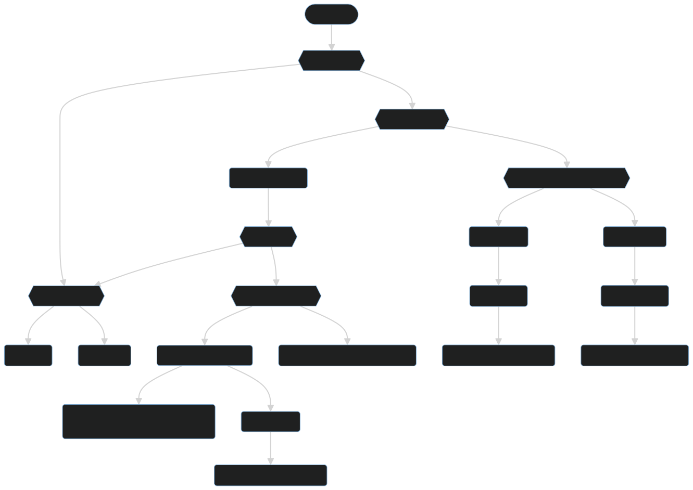

<!-- Copyright (C) myl7 -->
<!-- SPDX-License-Identifier: CC-BY-SA-4.0 -->

There are flowcharts on error handling in different programming languages

## TOC

## Rust

```mermaid
flowchart TD
    A([Rust errors]) --> B{{Recoverable?}}
    B -->|N| C{{Additional msg?}}
    C -->|N| D("<code>panic!()</code>")
    C -->|Y| E("<code>.expect()</code>")
    B -->|Y| F{{Need handling?}}
    F -->|N| G(Logging if required) --> GA{{Can abort?}}
    GA -->|N| H{{Existing error type?}}
    H -->|N| HA(Can add externl crates?)
    HA -->|N| HB("<code>return std::result::Result<_,<br />Box&lt;dyn std::error::Error>></code>")
    HA -->|Y| HC(Crate anyhow) --> HD("<code>return anyhow::Result</code>")
    H -->|Y| HE("<code>return std::result::Result</code>")
    GA -->|Y| C
    F -->|Y| I{{More than strings as context?}}
    I -->|N| J(Crate anyhow) --> K("<code>.context()</code>") --> L("<code>return anyhow::Result</code>")
    I -->|Y| M(Crate thiserror) --> N("<code>crate::Error</code>") --> O("<code>return crate::Result</code>")
```

